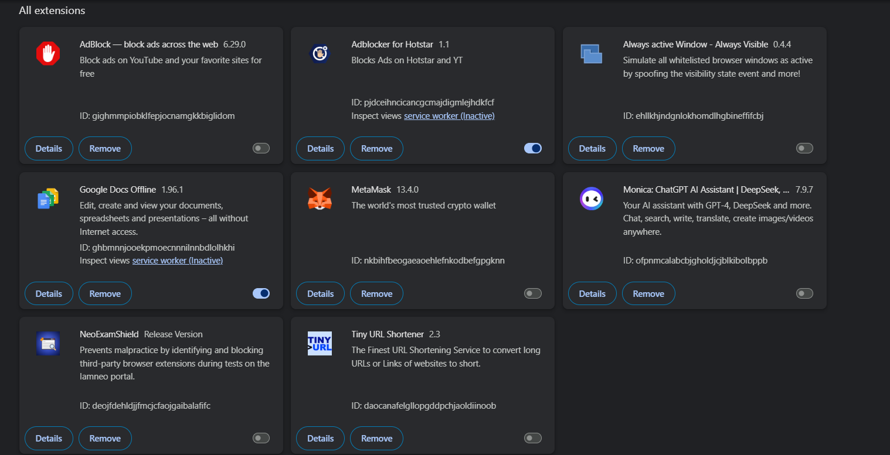
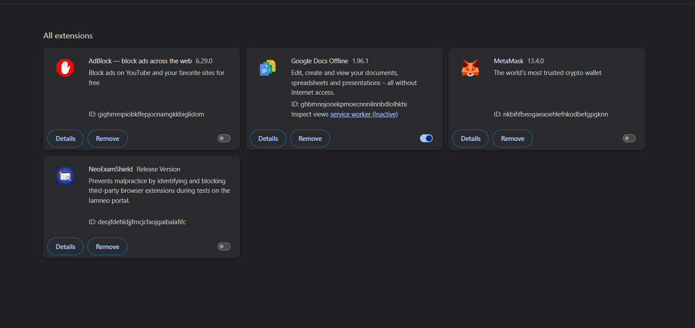

# Task 7: Identify and Remove Suspicious Browser Extensions

## Objective
Learn to identify potentially harmful browser extensions and remove them to improve browser security.

## Installed Extensions (Before Review)
- AdBlock — block ads across the web ✅ Safe  
- Adblocker for Hotstar ⚠️ Suspicious  
- Always Active Window - Always Visible ⚠️ Suspicious  
- Google Docs Offline ✅ Safe  
- MetaMask ✅ Safe (official version)  
- Monica: ChatGPT AI Assistant ⚠️ Suspicious  
- NeoExamShield ✅ Safe (exam-specific)  
- Tiny URL Shortener ⚠️ Suspicious  

## Actions Taken
1. Opened extension manager (`chrome://extensions/`).  
2. Reviewed installed extensions and researched their permissions/reputation.  
3. Identified **4 suspicious/unnecessary extensions**:  
   - Adblocker for Hotstar  
   - Always Active Window - Always Visible  
   - Monica: ChatGPT AI Assistant  
   - Tiny URL Shortener  
4. Removed these suspicious extensions.  
5. Restarted browser to apply changes.  

## Why These Extensions Were Suspicious
- Over-broad permissions (access to all websites, browsing data).  
- Low popularity or unofficial sources.  
- Potential for data leakage, phishing, or ad injection.  

## Outcome
- Removed 4 suspicious extensions.  
- Browser now has only trusted and necessary extensions.  
- Improved awareness of browser extension security risks.  

## Screenshots

### Before Removal

### After Removal

